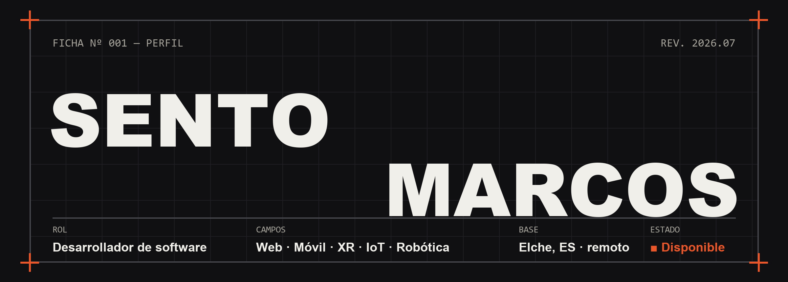

  

**[Portfolio](https://sentomarcos.github.io)** &nbsp;·&nbsp; **[LinkedIn](https://www.linkedin.com/in/sento-marcos-ibarra-56bba632b/)** &nbsp;·&nbsp; **[Instagram](https://www.instagram.com/sentomarcos_dev/)** &nbsp;·&nbsp; **[sento.marcos.dev@gmail.com](mailto:sento.marcos.dev@gmail.com)**

 

Graduado en **Tecnologías Interactivas** por la UPV — el primer grado 100% basado en proyectos de una universidad pública española. Construyo productos donde el software toca el mundo físico: interfaces, realidad extendida, sensores y robots. Y además del código: **coordinar y dirigir equipos de trabajo**.

 

## Proyectos

| Proyecto | Qué es | Enlaces |
|:---------|:-------|:--------|
| **Magna** 🟠 | Plataforma del acto de graduación de la EPSG — programa, invitaciones y entradas. **En producción.** | [magna.domioliving.com](https://magna.domioliving.com) |
| **AirFlow** | Plataforma IoT de calidad del aire: sensores BLE, app Android con biometría y API dockerizada | [API](https://github.com/SentoMarcos/AirFlow-Web) · [Android](https://github.com/SentoMarcos/AirFlow-Android) · [Arduino](https://github.com/SentoMarcos/AirFlow-Arduino) |
| **HispanoTech UGV** | Vehículo autónomo sobre TurtleBot3 — SLAM en tiempo real y navegación con ROS2 | [Repositorio](https://github.com/SentoMarcos/HispanoTech-UGC-ROS2) |
| **Museo Sonoro** | Portal web inmersivo de un museo de la música — Web Audio, visualizador, audio 8D | [Repositorio](https://github.com/SentoMarcos/mapas) |
| **WebMinutes** | Extensión de Chrome privacy-first para medir tu tiempo online (MIT) | [Repositorio](https://github.com/SentoMarcos/webminutes) |
| **ProyVR** | Experiencia de realidad virtual en Unity — interacción y presencia | [Repositorio](https://github.com/SentoMarcos/ProyVR) |

## Experiencia

- **Desarrollo de producto · [Domio Living](https://www.domioliving.com/)** — `2026 → act.`
  Startup PropTech nacida en la UPV: marketplace verificado de vivienda para estudiantes. Flutter, Python y web.
- **Desarrollador IoT full-stack · Engapplic** — `oct 2024 → jul 2026`
  IoT industrial: frontend Rust (Leptos), serverless Go/Rust en AWS (IoT SiteWise, Grafana), HMI industrial.
- **Grado en Tecnologías Interactivas · UPV** — `2022 → 2026`
  Campus de Gandia. Scrum + CDIO: un producto real en equipo cada semestre.

## Stack

| | |
|:--|:--|
| **Método & equipo** | Scrum · CDIO · dirección de grupos · Git flow · Figma · UX/UI |
| **Frontend** | JavaScript / TypeScript · React · Vue · Leptos (Rust→WASM) · GSAP |
| **Mobile** | Flutter / Dart · Android (Java / Kotlin) · biometría · BLE |
| **Backend & cloud** | Node.js · Python · Go · Rust · PostgreSQL · AWS · Docker · Grafana |
| **XR & juegos** | Unity · C# · XR Interaction Toolkit · Web Audio |
| **IoT & robótica** | Arduino · C++ · nRF52 · ROS2 (SLAM / Nav2) · HMI industrial |

 

¿Tienes algo entre manos? → **[Hablemos](mailto:sento.marcos.dev@gmail.com)**

